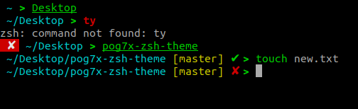

# pog7x-zsh-theme

[](LICENSE.md)

## Minimalistic oh-my-zsh theme

- Git prompt
- Unicode-compatible fonts and terminals

### Installation
```shell script
make install
```

Check out the instructions [here](https://github.com/ohmyzsh/ohmyzsh/wiki/Customization#overriding-and-adding-themes).

